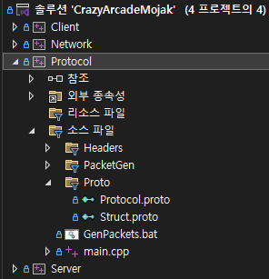

# 2026-03-12 클라에서 다른 플레이어 오브젝트의 예측 이동 제거, 물폭탄 벗어남 처리 개선
## 1. 클라 : Player에서 예측 이동 제거
### 이유
기존에 키 입력을 누르거나 뗄 때 이동 패킷을 전송하였고, 서버에서 이를 브로드캐스트하였음. Player는 Move state이면 클라 측의 캐릭터를 이동하고, 서버에서 패킷이 왔을 때 오차가 심하면 보정하였음. 문득 이와 같은 처리는 내 자신의 플레이어에 당장의 입력이 바로 반영되도록 하기 위한 것이었음을 상기하고, Player에는 이러한 처리가 필요 없음을 깨달음.
### 상세
충돌 처리를 포함한 예측 이동을 MyPlayer로 옮김. 대신에 클라 측에서 이동 패킷을 주기적으로 보내고, 서버는 이를 다시 브로드캐스트하여 다른 Player에서는 받은 위치로 보간하는 방식을 사용함.

MyPlayer (Client)
```
void MyPlayer::OnUpdateMove()
{
	float deltaTime = GET_SINGLE(TimeManager)->GetDeltaTime();

	Pos pos = GetPos();

	switch (_dir)
	{
	case DIR_LEFT:
		pos.x -= _moveSpeed * deltaTime;
		break;
	case DIR_RIGHT:
		pos.x += _moveSpeed * deltaTime;
		break;
	case DIR_UP:
		pos.y -= _moveSpeed * deltaTime;
		break;
	case DIR_DOWN:
		pos.y += _moveSpeed * deltaTime;
		break;
	}

	TryMove(pos);

	static float moveSyncTimer = 0.f;
	moveSyncTimer += deltaTime;

	const float MOVE_SYNC_INTERVAL = 0.05f; // 20Hz

	if (moveSyncTimer >= MOVE_SYNC_INTERVAL)
	{
		_moveDirtyFlag = true;
		moveSyncTimer = 0.f;
	}

	HandleMoveInput_Move();
	HandleBombInput();
}
```
Player (Client)
```
void Player::OnUpdateMove()
{
	float deltaTime = GET_SINGLE(TimeManager)->GetDeltaTime();

	Vec2 pos = GetPos();
	Vec2 diff = _serverPos - pos;
	float dist = diff.Length();

	if (diff.Length() < 1.f || diff.Length() > 200.f) // 도착하면 상태 변경. 너무 멀어도 바로 싱크.
	{
		SetPos(_serverPos);
		SetState(_serverState);
		return;
	}

	pos += diff * 20.f * deltaTime;

	SetPos(pos);
}
```
### 문제
Player에서 이동 패킷이 오면 state도 바로 따라서 변경하였더니, 아직 패킷의 위치로 도달하지 않았는데 state가 변경되어 멈추는 상황이 발생함.
### 해결
위 코드처럼 패킷의 위치로 도달했을 때 state를 바꾸도록 함. 이때 방향 역시 도달했을 때 바뀌는 것으로 해보았지만, 방향은 즉시 변경하는 것이 자연스러웠음.

## 2. 플레이어가 설치한 물폭탄에서 벗어나는 판단 처리 개선
### 이유
플레이어가 물폭탄을 설치했다가, 물폭탄에서 벗어났을 때 다시 물폭탄을 통과하지 못하게 하기 위해 물폭탄에서 벗어났을 때를 판단할 필요가 있었음. 다만 이를 위해 모든 물폭탄을 순회하는 건 낭비라 생각하여, 마지막으로 설치한 물폭탄을 Player가 들고 있도록 하고, 해당 물폭탄에 대해서만 검사를 하도록 했는데, 플레이어가 물폭탄을 설치할 시점에 다른 물폭탄과도 겹쳐있는 상태가 있을 수 있으므로, Player가 현재 겹쳐있는 물폭탄을 들고 있도록 하고 이를 검사함.
### 상세
MyPlayer(Client)의 OnUpdateMove() 中
```
for (auto it = _overlapBombs.begin(); it != _overlapBombs.end();)
{
    WaterBomb* bomb = *it;

    RECT r1 = GetRect();
    RECT r2 = bomb->GetRect();
    RECT r = {};

    if (::IntersectRect(&r, &r1, &r2) == false)
    {
        bomb->SetPassable(false);
        it = _overlapBombs.erase(it);
    }
    else
    {
        ++it;
    }
}
```
서버 측에서도 마찬가지로 구현하였음. 클라 측에서는 MyPlayer만 고려한 반면 서버 측에서는 모든 플레이어를 고려해야 하므로 WaterBomb에 passablePlayers를 들고 있도록 하였고, BlocksPlayer(player)에서 passablePlayers를 검사하여 플레이어가 통과 가능한지 반환하도록 함.

Player(Server)의 Update() 中
```
for (auto it = _overlapBombs.begin(); it != _overlapBombs.end();)
{
    WaterBombRef bomb = it->lock();

    if (!bomb)
    {
        it = _overlapBombs.erase(it);
        continue;
    }

    RECT r1 = GetRect();
    RECT r2 = bomb->GetRect();
    RECT r = {};

    if (::IntersectRect(&r, &r1, &r2) == false)
    {
        bomb->RemovePassablePlayer(shared_from_this());
        it = _overlapBombs.erase(it);
    }
    else
    {
        ++it;
    }
}
```
WaterBomb(Server) 中
```
virtual bool BlocksPlayer(const Player* player) const override
{
    for (auto& w : _passablePlayers)
    {
        auto p = w.lock();
        if (p.get() == player)
            return false;
    }

    return true;
}
```
## 느낀 점
입력 시 일단 동작하도록 하는 방식을 사용해서 그런지, 클라의 MyPlayer와 서버의 Player 동작이 거의 흡사하다. 클라의 나머지 오브젝트는 껍데기에 불과하다. 서버 권위를 두었다면 모든 오브젝트가 껍데기에 불과할 듯 하다.

# 2026-03-14 패킷 처리 자동화 및 전송 인터페이스 개선

## 1. proto 파일 컴파일 후 생성된 파일을 서버와 클라로 복사하는 작업을 별도 프로젝트로 분리
### 이유
해당 작업이 기존에 Server 프로젝트에 포함되어 있어 빌드 시 불필요한 시간을 소요함
### 상세
프로젝트를 클라이언트(Client), 서버(Server), 네트워크 라이브러리(Network), 프로토콜(Protocol)로 분리하였음.


## 2. 패킷 핸들러 함수 자동 생성 구현
### 이유
패킷이 추가될 때마다 반복적으로 하던 작업의 최소화 위함
### 상세
다음의 파일을 자동생성 및 복사하도록 함.
- PacketEnum.h (공통)
- ClientPacketHandler.h
- ClientPacketHandler.gen.cpp
- ServerPacketHandler.h
- ServerPacketHandler.gen.cpp

~PacketHandler.gen.cpp 에서 static 객체 생성을 이용하여 프로그램 실행 시 핸들러 함수를 핸들러 함수 전역 배열에 등록하도록 함. 앞으로 패킷 추가 시 ~PacketHandler.cpp 에서 대응하는 핸들러 함수만 작성하면 됨.


ClientPacketHandler.gen.cpp
```
REGISTER_PACKET(S_EnterGame, Protocol::S_EnterGame, ClientPacketHandler::Handle_S_EnterGame);
REGISTER_PACKET(S_MyPlayer, Protocol::S_MyPlayer, ClientPacketHandler::Handle_S_MyPlayer);
```

매크로(Network)
```
#define REGISTER_PACKET(ID, TYPE, FUNC) \
static PacketHandlerRegistry _reg_##ID( \
    MakeHandler<TYPE>(FUNC), ID)

template<typename PacketType, typename ProcessFunc>
PacketHandlerFunc MakeHandler(ProcessFunc func)
{
    return [func](SessionRef session, BYTE* buffer, int32 len)
        {
            PacketHeader* header = reinterpret_cast<PacketHeader*>(buffer);

            PacketType pkt;
            pkt.ParseFromArray(&header[1], header->size - sizeof(PacketHeader));

            func(session, pkt);
        };
}
```

PacketHandlerRegistry.h(Network)
```
PacketHandlerFunc GPacketHandler[UINT16_MAX];

class PacketHandlerRegistry
{
public:
    PacketHandlerRegistry(PacketHandlerFunc func, uint16 id)
    {
        GPacketHandler[id] = func;
    }
};
```


bat 파일로 [proto 컴파일 -> 코드 생성 -> proto 컴파일 파일 및 자동 생성 코드 복사] 를 한번에 처리할 수 있도록 함.

## 3. 패킷 전송 인터페이스 개선
### 이유
기존에 Make_{PacketName}(uint64 objectid, ...)과 같이 함수 인자로 패킷을 조립하여 SendBuffer를 반환하는 함수를 패킷 별로 만들고, 반환한 버퍼를 세션에서 Send(buffer)를 호출하여 전송하는 방식을 사용했는데, 번거로운 과정이라 느껴져 해당 함수를 사용하지 않고 패킷을 조립하여 바로 SendPacket(pkt)을 할 수 있도록 수정함
### 상세
기존
```
SendBufferRef sendBuffer = ServerPacketHandler::Make_S_MyPlayer(player->GetObjectId(), player->GetPos().x, player->GetPos().y, player->GetDir(), player->GetState(), player->GetMoveSpeed());
session->Send(sendBuffer);
```
바뀜
```
Protocol::S_MyPlayer pkt;
pkt.set_objectid(player->GetObjectId());
pkt.set_posx(player->GetPos().x);
pkt.set_posy(player->GetPos().y);
pkt.set_dir(player->GetDir());
pkt.set_state(player->GetState());
pkt.set_movespeed(player->GetMoveSpeed());
session->SendPacket(pkt);
```
### 문제
SendPacket에서 패킷을 인자로 받으면 패킷 아이디를 추출할 필요가 있었는데, 이를 위해 (패킷 이름, 패킷 아이디)의 unordered_map을 자동 생성으로 세팅하였음. 다만 패킷 아이디를 추출하는 과정에서 패킷에서 string 및 map lookup으로 인한 부하가 예상됨.

### 해결
다음과 같이 템플릿을 활용하여 컴파일 타임에 패킷에 따른 id가 결정되도록 함.

```
enum PacketId
{
    C_Move = 14,
    S_Move = 15,
};

template<typename T>
struct PacketIdType
{
};

template<>
struct PacketIdType<Protocol::C_Move>
{
    static const uint16 value = C_Move;
};

template<>
struct PacketIdType<Protocol::S_Move>
{
    static const uint16 value = S_Move;
};
```

# 2026-03-15 오브젝트 관리 구조 개선
## 1. 클라이언트 측 ObjectManager 구현
### 이유
기존에 서버 측에서 object id가 넘어오면, Scene에서 모든 오브젝트를 순회하며 id에  해당하는 오브젝트를 찾았는데, 오브젝트와 패킷이 많아질 수록 비용이 커질 거라 예상되어 탐색 복잡도를 줄이기 위해 (id, object)의 unordered_map을 가지는 ObjectManager를 추가하였음.
### 상세
서버와 연동되는 오브젝트들의 상위 클래스를 SyncObject라 두었고, ObjectManager에서 (id, SyncObject)의 unordered_map을 가지고 있음. 싱글톤으로 사용함.
```
class ObjectManager
{
	DECLARE_SINGLE(ObjectManager)

public:
	void RegisterSyncObject(SyncObject* obj);
	void UnregisterSyncObject(SyncObject* obj);
	SyncObject* GetSyncObject(uint64 id) { return _syncObjects[id]; }

private:
	unordered_map<uint64, SyncObject*> _syncObjects;
}
```
SyncObject에 id를 설정할 때, 해제될 때 자동으로 등록 및 등록 해제되도록 함.

```
void SyncObject::OnRelease()
{
	GET_SINGLE(ObjectManager)->UnregisterSyncObject(this);
}

void SyncObject::SetObjectId(uint64 objectId)
{
	_objectId = objectId;
	GET_SINGLE(ObjectManager)->RegisterSyncObject(this);
}
```
## 2. 서버 측 Object 관리 구조 개선
### 이유
오브젝트가 많아지며 한번에 관리를 해야겠다고 느낌. 클라이언트에서의 Object 관리 구조 모방.
### 상세
다음의 함수로 오브젝트가 컨테이너에 추가, 삭제되도록 함.
```
void GameRoom::RegisterObject(ObjectRef obj)
{
	_objects[obj->GetObjectId()] = obj;
	if (!obj->room)
		obj->room = shared_from_this();
}

void GameRoom::UnregisterObject(ObjectRef obj)
{
	if (!obj)
		return;

	uint64 id = obj->GetObjectId();
	_objects.erase(id);

	switch (obj->GetObjectType())
	{
	case OBJECT_TYPE_PLAYER:
		_players.erase(id);
		break;
	case OBJECT_TYPE_MAP_OBJECT:
	{
		MapObjectRef mapObj = static_pointer_cast<MapObject>(obj);

		switch (mapObj->GetMapObjectType())
		{
		case MAP_OBJECT_TYPE_WATER_BOMB:
			_bombs.erase(id);
			break;
		}

		Vec2Int tilePos = mapObj->GetTilePos();
		_mapObjects[tilePos.y][tilePos.x] = nullptr;
	}

		break;
	}

	obj->room = nullptr;
}
```
이때 모든 오브젝트는 _objects에 포함되며, _players, _bombs와 같이 따로 그룹화를 위해 정의한 컨테이너는 Spawn 함수를 따로 파서 추가되도록 하였음.

클라이언트에서와 마찬가지로 _objects를 순회하며 Update를 실행하고, dead 플래그가 세워진 오브젝트를 지움. RemoveDeadObjects() 안에서 UnregisterObject(obj)가 수행됨.
```
void GameRoom::Update()
{
	for (auto& item : _objects)
	{
		item.second->Update();
	}

	RemoveDeadObjects();
}
```
## 느낀 점
추가적인 컨테이너로 객체를 관리할 시, 객체를 삭제할 때 해당 컨테이너들도 비워주는 것을 잊지 말자.